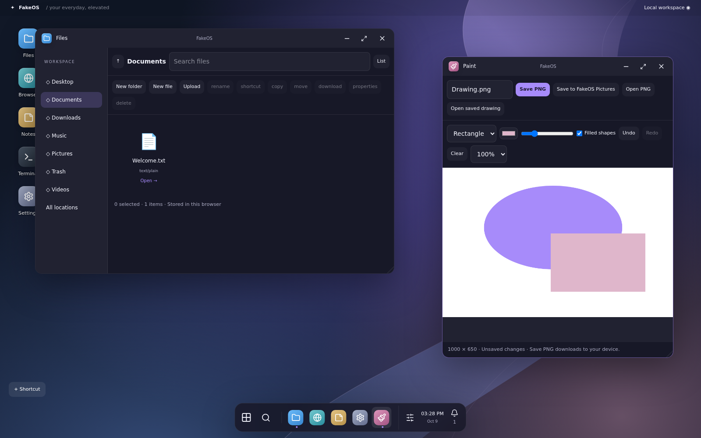
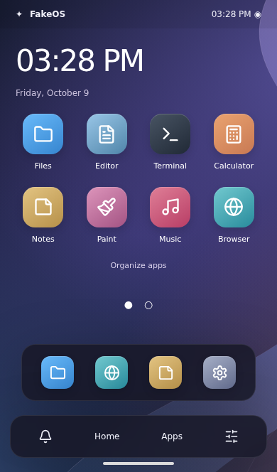

<div align="center">


# FakeOS

**Your everyday, elevated.**

A personal operating system that lives in your browser.

[**Launch FakeOS ↗**](https://albertinothecoder.github.io/FakeOS/) · [Features](#your-browser-your-workspace) · [Run locally](#run-locally) · [Development notes](docs/DEVELOPMENT.md)

[](https://github.com/AlbertinoTheCoder/FakeOS/actions/workflows/deploy.yml)


</div>



## Your browser, your workspace

Open a terminal, write a note, draw something, or organize your files. FakeOS brings familiar OS interactions together with an original glass interface and a calm, customizable workspace.

- **A real desktop experience:** draggable and resizable windows, snapping, taskbar, Start menu, shortcuts, and keyboard navigation. Computers and iPads share this interface.
- **A distinct phone interface:** home-screen pages, app folders, a dock, full-screen apps, and a multitasking switcher. Settings lets you choose either interface manually.
- **Thirteen working applications:** Files, Editor, Terminal, Calculator, Notes, Paint, Music, Browser, Settings, Activity, Clock, Store, and Games.
- **A shared filesystem:** documents, notes, images, and imported media are saved in IndexedDB and shared by the two interfaces in the same browser.
- **Paint that does more:** brush, eraser, fill, shapes, zoom, PNG reopening, and downloads to your computer.
- **Make it yours:** themes, wallpapers, accent colors, desktop shortcuts, app folders, contrast, text scaling, and reduced motion.
- **Keep a tidy desktop:** drag icons onto an invisible snap grid, swap occupied spots, or turn snapping off in Settings. Clock and quick-note widgets are available on desktop and phone home screens.
- **Offline Arcade:** install Minesweeper, Memory Match, and Beat Tap from the Store.
- **Share files easily:** drag files into Files, import ZIP archives, or export selected files and folders as a ZIP.
- **Take your work with you:** download a workspace backup and import copies without overwriting existing files.

<details>
<summary><strong>See the phone interface</strong></summary>



</details>

## Run locally

Requires **Node.js 22** and npm.

```sh
git clone https://github.com/AlbertinoTheCoder/FakeOS.git
cd FakeOS
npm ci
npm run dev
```

Open the URL printed by Vite. In **GitHub Codespaces**, use **Ports → 5173 → Open in Browser**; your device's localhost is not the Codespace.

```sh
npm run build     # Type-check and create dist/
npm run preview   # Preview the production build
npm test          # Filesystem, backups, clock, Paint, and browser navigation tests
```

For browser interaction tests, keep the dev server running:

```sh
npx playwright install --with-deps chromium
npm run test:browser
npm run test:features
```

## Publishing

The GitHub Actions workflow tests and builds FakeOS, then publishes it to **GitHub Pages** on pushes to `main`. The Pages build uses `/FakeOS/` as its base path. Other hosts can publish `dist/` with the default `/` base, or set `VITE_BASE_PATH` to another path.

## A few things to know

FakeOS is a browser application, not a replacement for your device's operating system. The terminal operates only on virtual files and never runs commands on your computer or Codespace. Browser navigation opens regular tabs by default because many websites refuse embedding.

Files stay in this browser and origin; clearing browser data can remove them. They do not automatically sync between devices. Use backups for important work. A PIN is a convenience screen lock, not encryption. Alarms need FakeOS open; browsers can delay background alerts. PDF viewing and video codecs depend on your browser.

The automated interaction checks use Chromium desktop and device emulation. Physical-device and Safari verification remain separate work. See [development notes](docs/DEVELOPMENT.md) for architecture, supported behavior, and remaining limitations.

## Built with

React · TypeScript · Vite · Tailwind CSS · Lucide · Motion · Zustand · IndexedDB

## Contributing

Issues and focused pull requests are welcome. Please describe how to reproduce a bug, include the interface/device you used, and verify `npm test` and `npm run build` before opening a pull request.

## License and credit

FakeOS is licensed under the [MIT License](LICENSE). Copies and substantial portions must retain the copyright notice crediting **AlbertinoTheCoder** and the license notice. If you share a fork or deploy your own version, a visible link back to this project is appreciated.

---

Made by [AlbertinoTheCoder](https://github.com/AlbertinoTheCoder).
